# Yowish<small>, a yellowish dark vim colorscheme</small>


## Description

Yowish is a vim dark theme similar to [outlander](https://atom.io/themes/outlander-syntax), with some yellow in it :smiley:  
It works well on both GUI & 256-colors terminal.

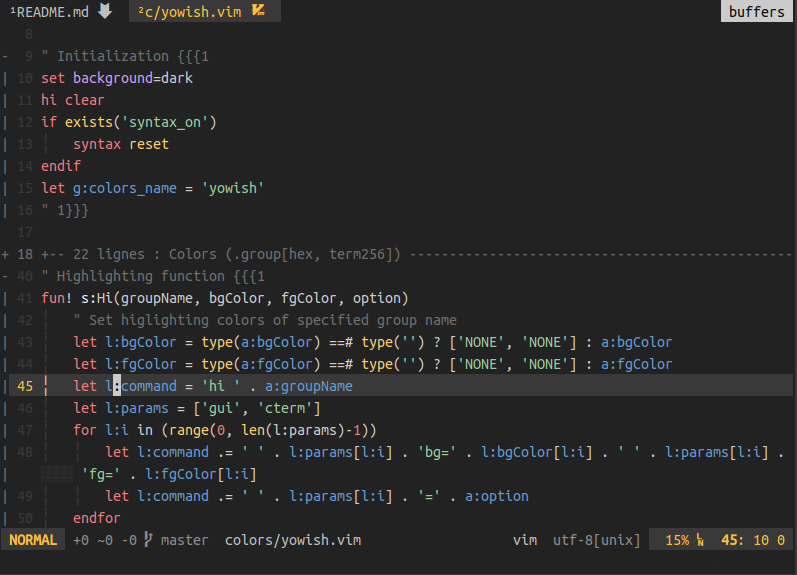

See supported [file types](#filetypes), customized [plugins](#plugins) and [screens](#screens).

**Note** [You can even use your own colors.](#custom-colors).

## GUI vs terminal

The colors in 256-color terminals are quite similar to the ones in the GUI version.  
Here is a comparison between GVim and xfce-terminal with a standard color palette:

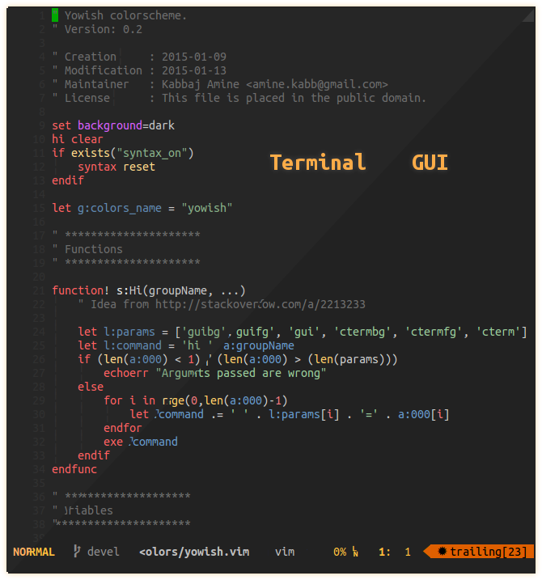

## Supported file types <a id="filetypes"></a>

Normally, any file type should be good looking, but some are more customized than others, check the [screens](#screens).

## Syntax plugins

The theme uses some elements from the following syntax plugins:

* `html`: [othree/html5.vim](https://github.com/othree/html5.vim)
* `pug`: [vim-pug](https://github.com/digitaltoad/vim-pug) (Formerly `jade`)
* `javascript`:
  - [othree/yajs.vim](https://github.com/othree/yajs.vim)
  - [pangloss/vim-javascript](https://github.com/pangloss/vim-javascript)
* `markdown`: [gabrielelana/vim-markdown](https://github.com/gabrielelana/vim-markdown)
* `php`: [StanAngeloff/php.vim](https://github.com/StanAngeloff/php.vim)

## Other plugins <a id="plugins"></a>

The theme provides custom colors for the following plugins (Note that you can disable them, see [configuration](#configuration) for that).

* [Agit](http://github.com/cohama/agit.vim)  
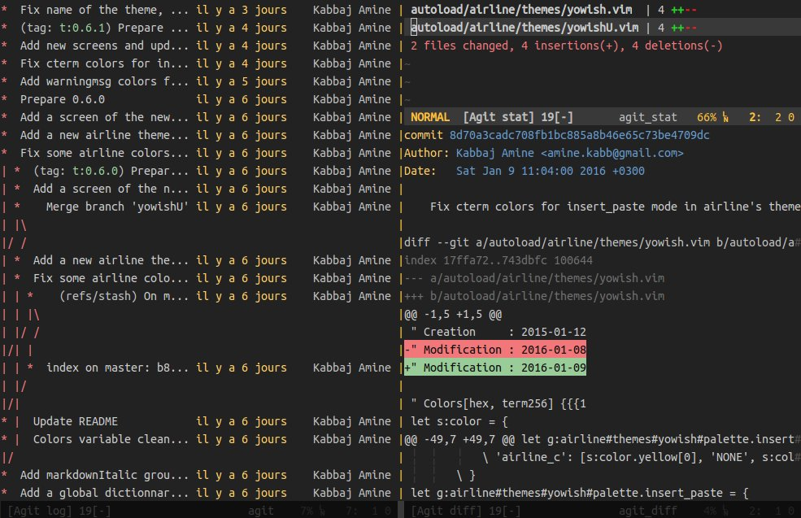

* [CtrlP](https://github.com/ctrlpvim/ctrlp.vim)  
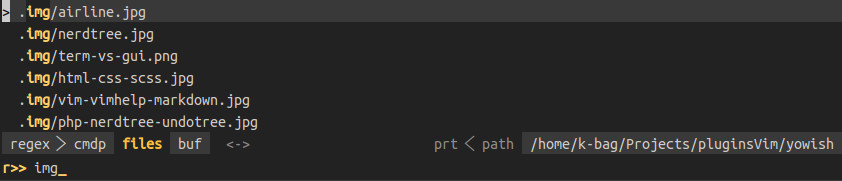

* [NERDTree](https://github.com/scrooloose/nerdtree)  
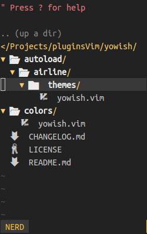

* [Lightline](https://github.com/itchyny/lightline.vim)  
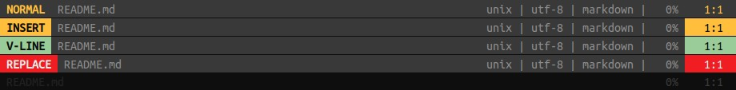

* [Signjk](https://github.com/haya14busa/vim-signjk-motion)  
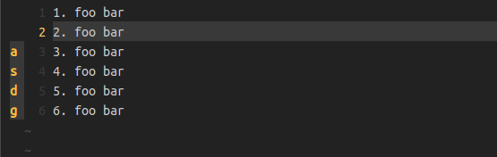

* Two [airline](https://github.com/vim-airline/vim-airline) themes:  
  * yowish  
  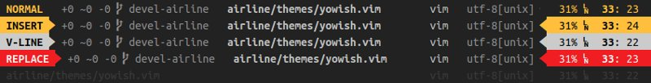
  * yowishU (*U for Unity*)  
  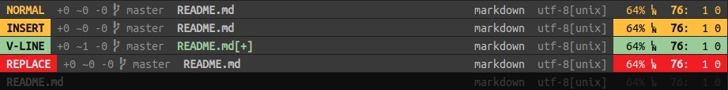

* [Unite](https://github.com/Shougo/unite.vim)  
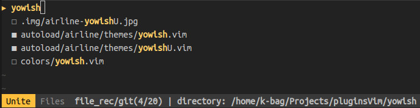

## Installation

Copy the distributed files into Vim runtime directory which is usually `~/.vim/`, or `$HOME/vimfiles` on Windows.

Or in a better way, use a vim plugin manager:

| Plugin manager                                         | In vimrc                         | Installation command |
|--------------------------------------------------------|----------------------------------|----------------------|
| [Vim-plug](https://github.com/junegunn/vim-plug)       | `Plug 'KabbAmine/yowish.vim'`      | `PlugInstall`          |
| [Vundle](https://github.com/gmarik/Vundle.vim)         | `Plugin 'KabbAmine/yowish.vim'`    | `PluginInstall`        |
| [NeoBundle](https://github.com/Shougo/neobundle.vim)   | `NeoBundle 'KabbAmine/yowish.vim'` | `NeoBundleInstall`     |

## Configuration <a id="configuration"></a>

The configuration of the plugin is stocked in one global dictionary `g:yowish`.  
To define/modify an option you can either:

```vim
let g:yowish = {}
let g:yowish.option1 = 'foo'
let g:yowish.option2 = 0
```

Or:

```vim
let g:yowish = {
			\ 'option1': 'foo',
			\ 'option2': 0
		\ }
```

## Options

**Be sure to define options before loading the colorscheme**

| key                       | default value                              | description                                                                                   |
| ------------------------- | ------------------------------------------ | --------------------------------------------------------------------------------------------- |
| `colors`                  | See [custom color palette](#custom-colors) | Color palette                                                                                 |
| `term_italic`             | `0`                                        | Use italic in terminal                                                                        |
| `comment_italic`          | `0`                                        | Use italic for comments                                                                       |
| `spell_bad_color`         | `NONE`                                     | Change foreground color for spell check errors (Use the color name from [color palette](#custom-colors))  |
| `ctrlp`                   | `1`                                        | Custom colors for CtrlP                                                                       |
| `unite`                   | `1`                                        | Custom colors for Unite                                                                       |
| `nerdtree`                | `1`                                        | Custom colors for NERDTree                                                                    |
| `agit`                    | `1`                                        | Custom colors for Agit                                                                        |
| `signjk`                  | `1`                                        | Custom colors for Signjk                                                                      |

#### Custom color palette <a id="custom-colors"></a>

Starting from version `0.7.3` you can modify the color palette used in the theme using `g:yowish.colors`.  
The values by default are:

```vim
g:yowish.colors = {
			\	'background'        : ['#222222', '235'],
			\	'backgroundDark'    : ['#0e0e0e', '232'],
			\	'backgroundLight'   : ['#393939', '236'],
			\	'comment'           : ['#6e6e6e', '242'],
			\	'green'             : ['#2acf2a', '40'],
			\	'lightBlue'         : ['#6699cc', '67'],
			\	'lightGreen'        : ['#99cc99','108']
			\	'lightRed'          : ['#f2777a', '203'],
			\	'lightViolet'       : ['#d09cea', '171'],
			\	'lightYellow'       : ['#ffcc66', '222'],
			\	'red'               : ['#f01d22', '160'],
			\	'selected'          : ['#373b41', '234'],
			\	'text'              : ['#cbcbcb', '251'],
			\	'textDark'          : ['#bebebe', '249'],
			\	'textExtraDark'     : ['#8c8c8c', '244'],
			\	'textLight'         : ['#ebebeb', '255'],
			\	'yellow'            : ['#ffbe3c', '215'],
			\ }
```

The value of each key is a list containing:

1. A hexadecimal color for GUI.
2. The equivalent 256-color for supported terminals.

Note that you can completely change the look, here is my personal custom palette:

```vim
let g:yowish.colors = {
            \	'background'       : ['#2f343f', 'none'],
            \	'backgroundDark'   : ['#191d27', '16'],
            \	'backgroundLight'  : ['#464b5b', '59'],
            \	'blue'             : ['#5295e2', '68'],
            \	'comment'          : ['#5b6176', '242'],
            \	'lightBlue'        : ['#e39f52', '179'],
            \	'lightYellow'      : ['#80aee3', '110'],
            \	'yellow'           : ['#5295e2', '68'],
            \ }
```

And there is how it looks in gvim & terminal vim.


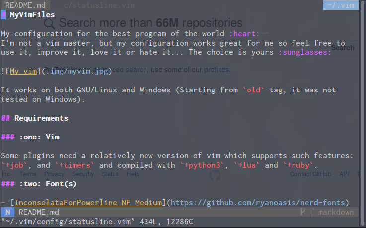

## Screens <a id="screens"></a>

Feel free to add screens for other file types or plugins.

`css`

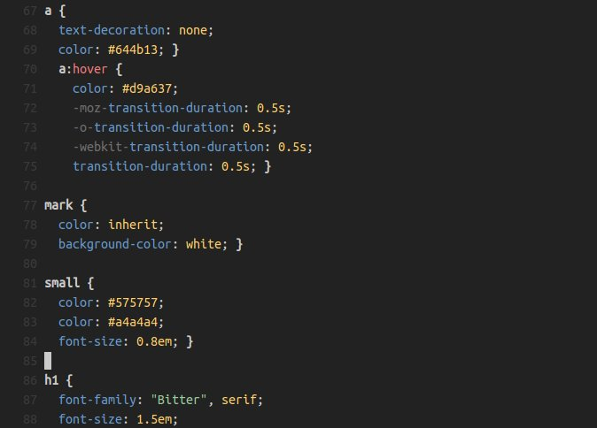

`html`

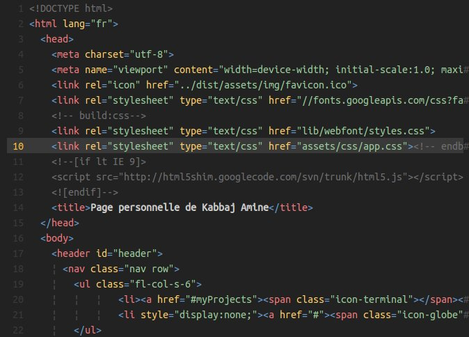

`pug`


`javascript`


`php`

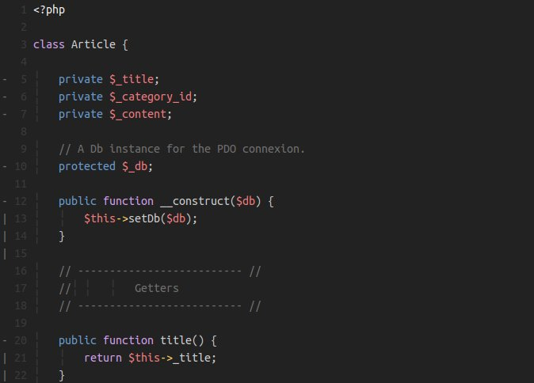

`ruby`


`scss`

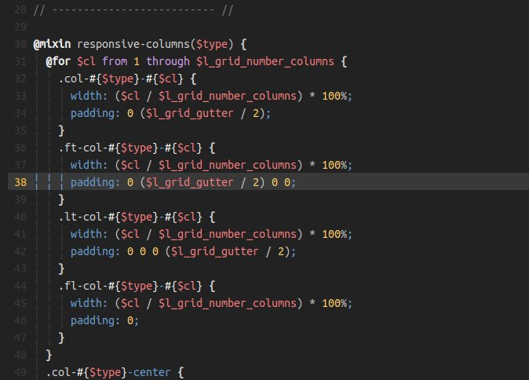

`sh`

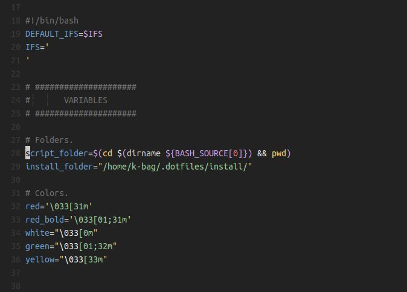

Diff with `coffeescript` files.

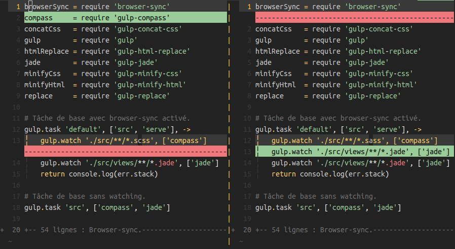

## Notes

Being the 1st vim colorscheme that I'm developing, feel free to report issues.
Pull requests are welcome, but please provide a before/after screenshot.

And if you're asking yourself, yeah I like yellow :smile:

## Todo

- Support more plugins if needed
- Better support for the following file types (PR are more than welcome):
  - [ ] `python`
  - [ ] `c`
  - [ ] `java`

## Thanks

Thanks to Bram Moolenaar for creating the best piece of software in the world :heart:

Thanks to you if you're using yowish.
