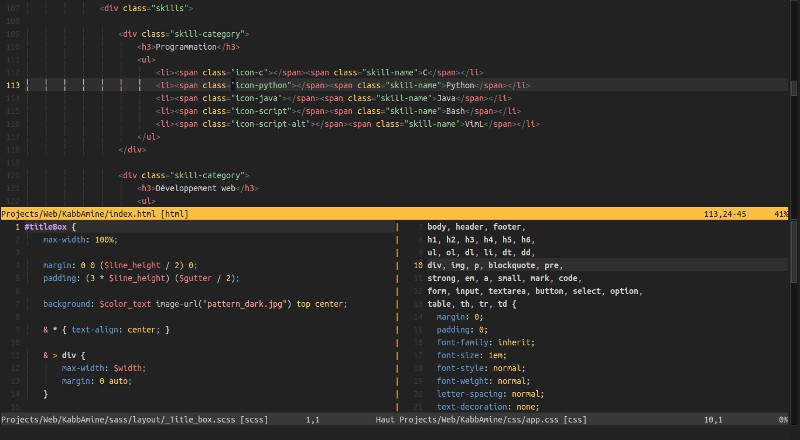
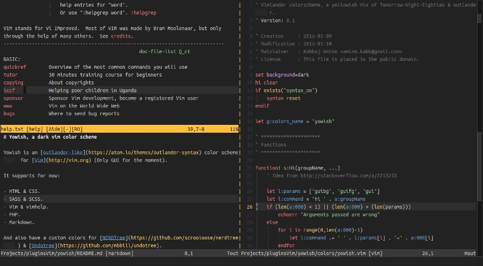
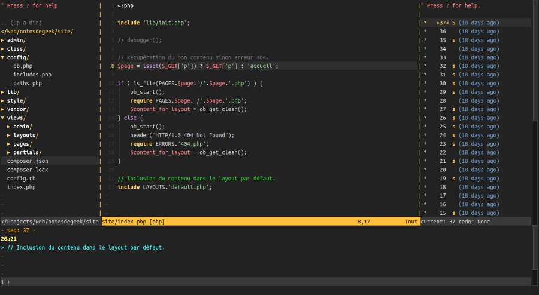

# Yowish, a yellowish dark vim colorscheme

## Description

Yowish is a vim dark theme similar to [outlander](https://atom.io/themes/outlander-syntax), with some yellow in it :smiley: (Works well on both GUI & 256-colors terminal)

It looks good on most file types, but shows his true colors in the following ones:

- `HTML` & `CSS`
- `SASS` & `SCSS`

  

- `Vim` & `vimhelp`
- `Markdown`

  

- `PHP`

  

## GUI vs terminal

The colors in 256-color terminals are quite similar to the ones in the GUI version.

Here is a comparison between GVim and xfce-terminal with a standard color palette:

## Plugins

The theme provides custom colors for the following plugins:
* [CtrlP](https://github.com/ctrlpvim/ctrlp.vim)

  

* [NERDTree](https://github.com/scrooloose/nerdtree)

  

* An [airline](https://github.com/bling/vim-airline) theme

  

## Installation

Copy the distributed files into Vim runtime directory which is usually `~/.vim/`, or `$HOME/vimfiles` on Windows.

Or in a better way, use a vim plugin manager:

| Plugin manager                                         | In vimrc                         | Installation command |
|--------------------------------------------------------|----------------------------------|----------------------|
| [Vim-plug](https://github.com/junegunn/vim-plug)       | `Plug 'KabbAmine/yowish.vim'`      | `PlugInstall`          |
| [Vundle](https://github.com/gmarik/Vundle.vim)         | `Plugin 'KabbAmine/yowish.vim'`    | `PluginInstall`        |
| [NeoBundle](https://github.com/Shougo/neobundle.vim)   | `NeoBundle 'KabbAmine/yowish.vim'` | `NeoBundleInstall`     |

## Notes

Being the 1st vim colorscheme that I'm developing, feel free to report issues and PR.

And if you're asking yourself, yeah I like yellow color :smile:

## Todo

- Better support for `python`, `c` and `java`...

## Thanks

Thank to Bram Moolenaar for creating the best piece of software in the world :heart:

Thank to you if you're using yowish.
