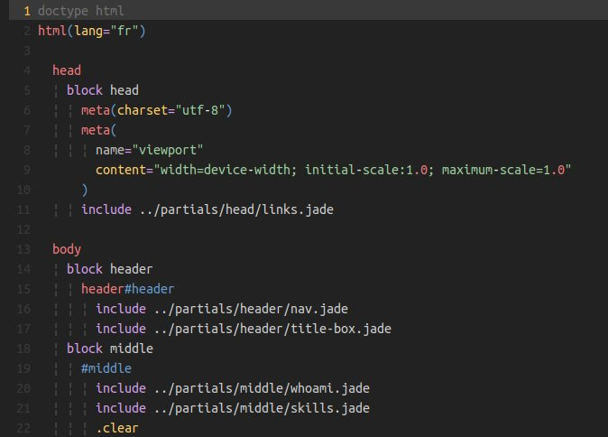

# Yowish<small>, a yellowish dark vim colorscheme</small> [](https://badge.fury.io/gh/KabbAmine%2Fyowish.vim)

-------------------------

## Description

Yowish is a vim dark theme similar to [outlander](https://atom.io/themes/outlander-syntax), with some yellow in it :smiley: (Works well on both GUI & 256-colors terminal).


It's a theme, and a theme needs [screens](#screens).

## GUI vs terminal

The colors in 256-color terminals are quite similar to the ones in the GUI version.

Here is a comparison between GVim and xfce-terminal with a standard color palette:


## Supported file types

Normally, any file type should be good looking, but some are more customized than others, check the [screens](#screens).

## Syntax plugins

The theme uses some elements from the following syntax plugins:

* `html`: [othree/html5.vim](https://github.com/othree/html5.vim)
* `jade`: [vim-jade](https://github.com/digitaltoad/vim-jade)
* `javascript`:
  - [othree/yajs.vim](https://github.com/othree/yajs.vim)
  - [pangloss/vim-javascript](https://github.com/pangloss/vim-javascript)
* `markdown`: [gabrielelana/vim-markdown](https://github.com/gabrielelana/vim-markdown)
* `php`: [StanAngeloff/php.vim](https://github.com/StanAngeloff/php.vim)

## Other plugins

The theme provides custom colors for:

* [CtrlP](https://github.com/ctrlpvim/ctrlp.vim)

  

* [NERDTree](https://github.com/scrooloose/nerdtree)

  

* And 2 [airline](https://github.com/bling/vim-airline) themes:

  * yowish
  

  * yowishU (*U for Unity*)
  

## Installation

Copy the distributed files into Vim runtime directory which is usually `~/.vim/`, or `$HOME/vimfiles` on Windows.

Or in a better way, use a vim plugin manager:

| Plugin manager                                         | In vimrc                         | Installation command |
|--------------------------------------------------------|----------------------------------|----------------------|
| [Vim-plug](https://github.com/junegunn/vim-plug)       | `Plug 'KabbAmine/yowish.vim'`      | `PlugInstall`          |
| [Vundle](https://github.com/gmarik/Vundle.vim)         | `Plugin 'KabbAmine/yowish.vim'`    | `PluginInstall`        |
| [NeoBundle](https://github.com/Shougo/neobundle.vim)   | `NeoBundle 'KabbAmine/yowish.vim'` | `NeoBundleInstall`     |

## Configuration

The user configuration is stocked in a global dictionary `g:yowish` where:

| key                       | default value             | description                             |
| ------------------------- | ------------------------- | --------------------------------        |
| `term_italic`             | `0`                       | Enable(1)/Disable(0) italic in terminal |

Currently, only one option is present, but this will change in the future.

e.g

```
let g:yowish = {}
let g:yowish.term_italic = 1

" Or

let g:yowish = {
			\ 'term_italic': 1,
			\ }
```

## Screens <a id="screens"></a>

Feel free to add screens for other file types.

`css`


`html`


`jade`



`javascript`


`php`


`ruby`


`scss`


`sh`


## Notes

Being the 1st vim colorscheme that I'm developing, feel free to report issues.
Pull requests are welcome, but please provide a before/after screenshot.

And if you're asking yourself, yeah I like yellow :smile:

## Todo

- Support more plugins
- Better support for the following file types (PR are more than welcome):
  - [x] [`javascript`](https://github.com/KabbAmine/yowish.vim/issues/3)
  - [x] [`ruby`](https://github.com/KabbAmine/yowish.vim/issues/1)
  - [ ] `python`
  - [ ] `c`
  - [ ] `java`
- A simple html page for screenshots

## Thanks

Thanks to Bram Moolenaar for creating the best piece of software in the world :heart:

Thanks to you if you're using yowish.
